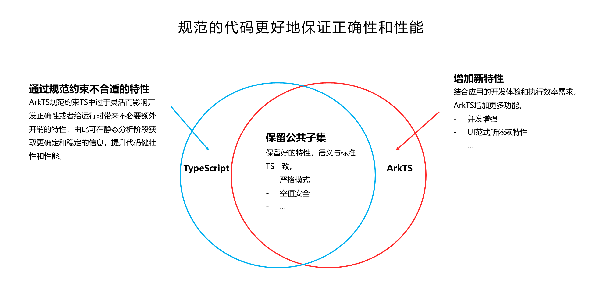

<!-- ---
title: "ArkTS基础语法"
format: html
toc: true
--- -->

# ArkTS基础语法

> TypeScript在JavaScript的基础上添加静态类型定义
>
> ArkTS在TypeScript的基础上，匹配ArkUI框架，扩展了声明式UI描述、自定义组件、动态扩展UI元素、状态管理和渲染控制、并发任务等多种能力。
>
> ArkTS通过规范约束了TS中过于灵活而影响开发正确性或者给运行时带来不必要额外开销的特性。



## ECMAScript关键字

|||||
|--|--|--|--|
|break |do| instanceof| typeof|
|case |else |new |var|
|catch |finally |return |void|
|continue |for |switch |while|
|debugger |function |this| with|
|default |if| throw||
|delete |in |try||
|class |enum| extends| super|
|const |export |import||
|implements| let |private| public|
|interface| package |protected |static|
|yield||||

## 变量声明

* `let`允许在块级作用域中声明变量，而`var`声明的变量具有函数级作用域。
* `const`声明的变量是常量，其值在初始化后不能更改。
* `static`静态字段属于类本身，类的所有实例共享一个静态字段。
* 限制使用`public`、`protected`、`private`三种方式修饰字段可见性，默认`public`。

```typescript
// 示例代码
const fontSize = "16fr";

class MagicWord {
  static readonly TAG: string = "[MagicWord]"
  static greeting() {
    console.log('Hello world');
  }
}
```

## 基础类型

* 数字`number` `Number`所有的数字都是浮点数，支持十进制、二进制、八进制和十六进制表示。
* 字符串`string`使用双引号(`"`)或单引号(`'`)表示。
* 布尔用于`boolean`标识true和false。
* 数组`array`有两种方式定义数组使用`[]`后缀或`Array<类型>`泛型。
* 枚举类型`enum`可以为一组数值赋予友好的名字。
* 对象类型`Object`是所有引用类型的基类型。任何值，包括基本类型的值（它们会被自动装箱），都可以直接被赋给Object类型的变量。
* 空值`null`表示变量值为空。
* 未定义类型`undefined`表示变量值未定义。
* 空类型`void`用于指定函数没有返回值。由于void是引用类型，因此它可以用于泛型类型参数。
* 元组类型表示一个已知元素数量和类型的数组，各元素的类型不必相同。
* 联合类型`union`表示取值可以为多种类型中的一种。
* 匿名类型`alias`匿名类型（数组、函数、对象字面量或联合类型）提供名称，或为已有类型提供替代名称。

```typescript
// 变量数字
let n0 = 0x123;
let n1 = 0b11;
let n2 = 3.141592;
let n3 = .5;
let n4 = 1e10; // e 或者 E
// 常量字符串
const str: string = "Hello, World!";
// 布尔
var isTrue: boolean = true;
// 自动类型推断
let hi = "Hello World"; // typeof hi === "string"
// 数组
let arr1: number[] = [1, 2, 3];
let arr2: Array<string> = ["a", "b", "c"];
// 枚举
enum Color {White = 0xFF, Grey = 0x7F, Black = 0x00 }; 
let c: Color = Color.Grey;
// // 未知类型，运行时确定，编译时不固定
// let notSure: unknown = 4;
// notSure = 'maybe a string instead';
// notSure = false;
// undefined 和 null
let u: undefined = undefined;
let n: null = null;
// 元组，类型固定、长度固定
let tuple: [string, number, boolean] = ['hello', 42, true];
// 联合类型
let myFavoriteNumber: string | number;
myFavoriteNumber = 'seven';
myFavoriteNumber = 7;
// 匿名类型，定义别名
type Matrix = number[][];
type Handler = (s: string, no: number) => string;
type Predicate <T> = (x: T) => Boolean;
type NullableObject = Object | null;
```

<!-- ```typescript
type Point = {
  x: number;
  y: number;
};
class Point {
  x: number;
  y: number;
}
``` -->

## 运算符

* 赋值运算符
* 比较运算符
* 算术运算符
* 位运算符
* 逻辑运算符
* 展开运算符（慎用）

```typescript
let a = 123; // 赋值
// 复合赋值运算符 +=、-=、*=、/=、%=、<<=、>>=、>>>=、&=、|=、^=。
a += 1; // a=124
a -= 1; // a=123
a *= 1; // a=123
a /= 1; // a=123
a %= 2; // a=1
a <<= 2; // a=4
a >>= 1; // a=2
a >>>= 1; // a=1
a &= 0; // a=0
a |= 1; // a=1
a ^= 0; // a=1
// 比较运算符 ==、!=、>、>=、<、<=
a == 1 // true
a != 0 // true
a > 0 // true
a >= 0 // true
a < 2 // true
a <= 1 // true
// 一元运算符 -、+、~、--、++
-a // -1
+a // 1
~a // -2 位非运算
--a // 0, a=0
a-- // 0, a=-1
++a // 0, a=0
a++ // 0, a=1
// 二元运算符 +、-、*、/、%
// 位运算符 &、|、^、~、<<、>>、>>>
// 逻辑运算符 &&、||、!

// 展开运算符
class DerivedFromArray extends Uint16Array {};
let arr1 = [1, 2, 3];
let arr2 = new Uint16Array([4, 5, 6]);
let arr3 = new DerivedFromArray([7, 8, 9]);
let arr4 = [...arr1, 10, ...arr2, 11, ...arr3];
```

## 条件语句

* `if...else` 语句
* `switch...case` 语句
* 条件表达式

```typescript
// 条件语句 if...else 语句
var num:number = 12; 
if (num % 2==0) { 
    console.log('偶数'); 
} else {
    console.log('奇数'); 
}
// 条件语句 switch...case 语句
var grade:string = 'A'; 
switch(grade) { 
  case 'A': { 
    console.log('优'); 
    break; 
  } 
  case 'B': { 
    console.log('良'); 
    break; 
  } 
  case 'C': {
    console.log('及格'); 
    break;    
  } 
  case 'D': { 
    console.log('不及格'); 
    break; 
  }  
  default: { 
    console.log('非法输入'); 
    break;              
  } 
}
// 条件表达式
let isValid = Math.random() > 0.5 ? true : false;
let message = isValid ? 'Valid' : 'Failed';
```

## 循环语句/迭代器

* `for...of` 语句
* 禁止使用~~`for...in` 语句~~

```typescript
let someArray = [1, "string", false];
for (let i = 0; i < someArray.length; i++) {
  console.log(someArray[i]); // 1, "string", false
}
for (let entry of someArray) {
  console.log(entry); // 1, "string", false
}
// for (let index in someArray) {
//   console.log(someArray[index]); // 1, "string", false
// }
someArray.forEach((entry, index, array) => {
  console.log(entry); // 1, "string", false
})
```

<!-- ```typescript
let n = 0;
let x = 0;
while (n < 3) {
  n++;
  x += n;
}

let i = 0;
do {
  i += 1;
} while (i < 10)

let x = 0;
while (true) {
  x++;
  if (x > 5) {
    break;
  }
}

let x = 1
label: while (true) {
  switch (x) {
    case 1:
      // statements
      break label // 中断while语句
  }
}

let sum = 0;
for (let x = 0; x < 100; x++) {
  if (x % 2 == 0) {
    continue
  }
  sum += x;
}
``` -->

## 异常捕获

* `throw` 语句
* `try...catch` 语句
* `Promise` 连接`catch`语句

```typescript
try {
  // ArkTS只支持抛出Error类或其派生类的实例。禁止抛出其他类型（例如number或string）的数据。
  throw new Error('this error'); 
} catch (e) { // 不支持在catch语句标注类型
  console.log("Oh well.");
} finally {
  console.log("final");
}

let call: Promise<void> = Promise.reject("error!");
call.catch((e) => console.log(e));

new Promise((resolve, reject) => {
    reject('error')
}).catch((e) => console.log(e));
```

## 函数

* 使用`function`关键字定义函数，可省略。
* 箭头函数`lambda`是定义匿名函数的简写语法，省略`function`关键字。
* 可选参数，参数名后跟问号`?`。
* 不固定参数，参数名前加省略号`...`，参数类型为数组，必须是函数最后一个参数。
* 函数重载，不允许重载函数有相同的名字以及参数列表。

```typescript
// 函数
function test(): void {
   console.log('This is function is void');
}
function test() {
    console.log('This is function is void');
}
// 箭头函数，Lambda函数
window.addEventListener("on", (event) => console.log(`on event ${event}`))
// 可选参数
function buildName(firstName: string, lastName?: string) {
    lastName ??= 'Unknown' 
    return firstName + ' ' + lastName
}
// 不固定参数
function getEmployeeName(firstName: string, ...restOfName: string[]) {
  return firstName + ' ' + restOfName.join(' ');
}
// 函数声明
type trigFunc = (x: number) => number
// 函数重载
function foo(x: number): void;  // 定义number参数类型
function foo(x: string): void; // 定义string参数类型
// 根据上述定义编写函数实现
function foo(x: number | string): void {
  /* 函数实现 */
}
// 非函数重载
interface Document {
  createElement(tagName: number): HTMLDivElement
  createElement(tagName: boolean): HTMLSpanElement
  createElement(tagName: string, value: number): HTMLCanvasElement
  createElement(tagName: string): HTMLElement
  createElement(tagName: Object): Element
}
```

## 接口与类

* 接口`interface`用于定义对象的结构。
* 类`class`是TypeScript中面向对象编程的基础，可以包含属性、方法和构造函数。
* 静态方法`static`属于类本身，只能访问静态字段。

```typescript
// 别名
type Birthday = [number, number, number]
type Horoscope = '♌️' | '♐️'
// 接口
interface PersonInterface {
    birthday: Birthday
    horoscope(): Horoscope
}
// 类
class Person implements PersonInterface {
  private name: string = "" // 初始化赋值
  private age: number = 0 // 初始化赋值，或者指定可空 age: number?
  birthday: Birthday = [2000, 10, 21]

  constructor(name: string, age: number) {
    this.name = name;
    this.age = age;
  }

  public getPersonInfo(): string {
    return `My name is ${this.name} and age is ${this.age}`;
  }

  horoscope(): Horoscope {
    return '♌️'
  } 
}
let person1 = new Person('Jacky', 18);
person1.getPersonInfo();
person1.horoscope();
// 类继承
class Employee extends Person {
  private department: string = ""

  constructor(name: string, age: number, department: string) {
    super(name, age);
    this.department = department;
  }

  public getEmployeeInfo(): string {
    return this.getPersonInfo() + ` and work in ${this.department}`;
  }
}
let person2 = new Employee('Tom', 28, 'HuaWei');
person2.getPersonInfo();
person2.getEmployeeInfo();
// 对象字面量表达式
class C {
  n: number = 0
  s: string = ''
}
let c: C = {n: 42, s: 'foo'};  // 使用变量的类型，代替 new 表达式
```

## 空安全

> 默认情况下，ArkTS中的所有类型都是不可为空的，因此类型的值不能为空。
>
> 这类似于TypeScript的严格空值检查模式（strictNullChecks），但规则更严格。

* 可空变量定义，联合类型`T | null | undefined`。
* 非空断言运算符，后缀运算符!可用于断言其操作数为非空。应用于空值时，运算符将抛出错误。
* 空值合并运算符
* 可选链运算符

```typescript
let x: number = null;    // 编译时错误
let y: string = null;    // 编译时错误
let z: number[] = null;  // 编译时错误
// 可空变量定义
let x: number | null = null;
x = 1;    // ok
x = null; // ok
if (x != null) { 
  // 非空断言运算符
  console.log(x!)
}
// 空值合并运算符
let y = x ?? 0; // y = x != null ? x : 0

class Person {
  nick: string | null = null
  spouse?: Person

  constructor(nick: string) {
    this.nick = nick;
    this.spouse = undefined;
  }
}
// 可选链运算符
let p: Person = new Person('Alice');
p.spouse?.nick; // undefined
```

## 模块与命名空间

* 使用`import`和`export`关键字进行模块之间的代码共享。
* 命名空间`namespace`用于将相关的代码组织在一起，避免命名冲突。

```typescript
export namespace Shapes {
  export class Triangle {
    /* ... */
  }
  export class Square {
    /* ... */
  }
}
import * as shapes from "./shapes";
let t = new shapes.Shapes.Triangle();

// declare module "SomeModule" {
//   export function normalize(s: string): string;
// }
// import * as m from "SomeModule";
// // 从原始模块中导入需要的内容
// import { normalize } from 'someModule'
```

## ArkTS限制

* 不支持`var`，请使用`let`声明变量，局部不可变用`const`。
* 禁止使用`any`类型
* 不支持`any`和`unknown`类型。显式指定具体类型。
* 不支持`with`语句
* 不支持`is`语句
* 慎用`keyof`、`typeof`、`instanceof`。
* 慎用`globalThis`。
* 仅支持`Partial`、`Required`、`Readonly`和`Record`，不支持TypeScript中其他的Utility Types。
* 不支持*解构/析构*变量声明或者函数的参数声明。
* 非`void`返回类型函数，尽量*标注*返回类型。
* 开发过程中注意区分，*变量*、*函数*、*类*、*接口*、*枚举类型/枚举值*、*命名空间*。

<!-- ```javascript
限制使用标准库
ArkTS不允许使用TypeScript或JavaScript标准库中的某些接口。
大部分接口与动态特性有关。ArkTS中禁止使用以下接口：

全局对象的属性和方法：eval

Object：__proto__、__defineGetter__、__defineSetter__、 __lookupGetter__、__lookupSetter__、assign、create、 defineProperties、defineProperty、freeze、 fromEntries、getOwnPropertyDescriptor、getOwnPropertyDescriptors、 getOwnPropertySymbols、getPrototypeOf、 hasOwnProperty、is、isExtensible、isFrozen、 isPrototypeOf、isSealed、preventExtensions、 propertyIsEnumerable、seal、setPrototypeOf

Reflect：apply、construct、defineProperty、deleteProperty、 getOwnPropertyDescriptor、getPrototypeOf、 isExtensible、preventExtensions、 setPrototypeOf

Proxy：handler.apply()、handler.construct()、 handler.defineProperty()、handler.deleteProperty()、handler.get()、 handler.getOwnPropertyDescriptor()、handler.getPrototypeOf()、 handler.has()、handler.isExtensible()、handler.ownKeys()、 handler.preventExtensions()、handler.set()、handler.setPrototypeOf()
``` -->

```typescript
let value_b: boolean = true; // 或者 let value_b = true
let value_n: number = 42; // 或者 let value_n = 42
let value_o1: Object = true;
let value_o2: Object = 42;
interface Identity {
  id: number
  name: string
}
interface Contact {
  email: string
  phoneNumber: string
}
interface Employee extends Identity,  Contact {}
// ArkTS不支持正则字面量，请使用RegExp()创建正则对象。
let regex: RegExp = new RegExp('bc*d');
// 不支持解构/析构变量声明。
class Point {
  x: number = 0.0
  y: number = 0.0
}
let {x, y} = new Point(); // 编译错误
// ArkTS不支持在函数内声明函数，改用lambda函数。
function addNum(a: number, b: number): void {
  // 使用lambda函数代替声明函数
  let logToConsole: (message: string) => void = (message: string): void => {
    console.log(message);
  }
  let result = a + b;
  logToConsole('result is ' + result);
}
// instanceof 结合 as 使用
class Foo {
  foo: string = ''
  common: string = ''
}
class Bar {
  bar: string = ''
  common: string = ''
}
function doSomething(arg: Object) {
  if (arg instanceof Foo) {
      const foo = arg as Foo
      console.log(foo.common)
  } else if (arg instanceof Bar) {
      const bar = arg as Bar
      console.log(bar.common) // 必须 as 转换之后访问属性
  }
}
doSomething(new Foo())
doSomething(new Bar())
```

## ArkTS声明式UI组件示例

```typescript
@Entry
@Component
struct HelloWorld {
  @State mText: string = 'World'

  build() {
    Column() {
      Text(`Hello ${this.mText}`)
        .fontSize(50)
        .fontWeight(FontWeight.Bold)
      Divider()
      Button('Click me')
        .onClick(() => {
          this.mText = 'ArkUI'
        })
        .height(50)
        .width(100)
        .margin({ top: 20 })
    }
  }
}
```

* 装饰器：用于装饰类、结构、方法以及变量，并赋予其特殊的含义。如上述示例中@Entry、@Component和@State都是装饰器，@Component表示自定义组件，@Entry表示该自定义组件为入口组件，@State表示组件中的状态变量，状态变量变化会触发UI刷新。
* UI描述：以声明式的方式来描述UI的结构，例如build()方法中的代码块。
自定义组件：可复用的UI单元，可组合其他组件，如上述被@Component装饰的struct HelloWorld。
* 系统组件：ArkUI框架中默认内置的基础和容器组件，可直接被开发者调用，比如示例中的Column、Text、Divider、Button。
* 属性方法：组件可以通过链式调用配置多项属性，如fontSize()、width()、height()、backgroundColor()等。
* 事件方法：组件可以通过链式调用设置多个事件的响应逻辑，如跟随在Button后面的onClick()。
* 系统组件、属性方法、事件方法具体使用可参考基于ArkTS的声明式开发范式。

## 文件类型

* `.ts` TypeScript源码文件类型，仅可使用TypeScript标准语法
* `.ets` 可使用ArkTS基础类库API
* `.d.ts` 类、方法、变量的声明文件，用于描述类、方法、变量的类型信息，可用于IDE的代码补全、类型检查等。

## 扩展阅读

* [ECMAScript 5.1 语言规范](https://262.ecma-international.org/5.1/)
* [TypeScript手册](https://www.typescriptlang.org/docs/handbook/intro.html)
* [操作符](https://developer.mozilla.org/en-US/docs/Web/JavaScript/Reference/Operators)
* [**从TypeScript到ArkTS的适配规则**](https://docs.openharmony.cn/pages/v4.0/zh-cn/application-dev/quick-start/typescript-to-arkts-migration-guide.md)
