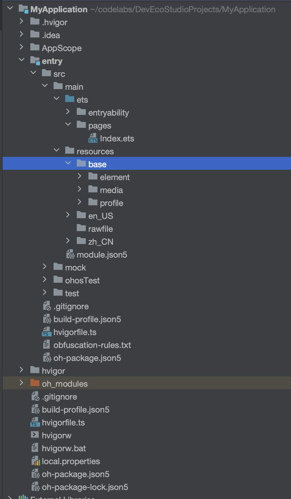

# 鸿蒙应用资源文件及使用



## 资源分类

> `AppScope/resources`、`src/main/resources`用于存放应用/服务所用到的资源文件，如图形、多媒体、字符串、布局文件等。

* base目录(资源组目录)

  > base目录是默认存在的目录，，二级子目录element用于存放字符串、颜色、布尔值等基础元素，media、profile存放媒体、动画、布局等资源文件。
  >
  > 目录中的资源文件会被编译成二进制文件，并赋予资源文件ID。
  >
  > 通过指定资源类型（type）和资源名称（name）引用。

  * element

    > 表示元素资源，以下每一类数据都采用相应的JSON文件来表征（目录下仅支持文件类型）。
    >
    > element目录中的文件名称建议与下面的文件名保持一致。每个文件中只能包含同一类型的数据。

    * boolean，布尔型，boolean.json
    * color，颜色，color.json
    * float，浮点型，float.json
    * intarray，整型数组，intarray.json
    * integer，整型，integer.json
    * pattern，样式，pattern.json
    * plural，复数形式，plural.json
    * strarray，字符串数组，strarray.json
    * string，字符串，string.json

  * media
  
    > 表示媒体资源，包括图片、音频、视频等非文本格式的文件（目录下只支持文件类型）。
    >
    > 文件名可自定义，例如：icon.png。

  * profile

    > 表示自定义配置文件，其文件内容可通过包管理接口获取（目录下只支持文件类型）。
    >
    > 文件名可自定义，例如：test_profile.json。

* 限定词目录（扩展阅读）

  > en_US和zh_CN是默认存在的两个限定词目录，其余限定词目录需要开发者根据开发需要自行创建。同base目录一样

* rawfile目录(资源目录)

  > 支持创建多层子目录，目录名称可以自定义，文件夹内可以自由放置各类资源文件。
  >
  > 目录中的资源文件会被直接打包进应用，不经过编译，也不会被赋予资源文件ID。通过指定文件路径和文件名引用。

### 资源目录示例

```js
resources
|---base
|   |---element
|   |   |---string.json
|   |---media
|   |   |---icon.png
|   |---profile
|   |   |---test_profile.json
|---en_US  // 默认存在的目录，设备语言环境是美式英文时，优先匹配此目录下资源
|   |---element
|   |   |---string.json
|   |---media
|   |   |---icon.png
|   |---profile
|   |   |---test_profile.json
|---zh_CN  // 默认存在的目录，设备语言环境是简体中文时，优先匹配此目录下资源
|   |---element
|   |   |---string.json
|   |---media
|   |   |---icon.png
|   |---profile
|   |   |---test_profile.json
|---en_GB-vertical-car-mdpi // 自定义限定词目录示例，由开发者创建
|   |---element
|   |   |---string.json
|   |---media
|   |   |---icon.png
|   |---profile
|   |   |---test_profile.json
|---rawfile // 其他类型文件，原始文件形式保存，不会被集成到resources.index文件中。文件名可自定义。
```

### 资源文件示例

color.json文件的内容如下

```json
{
  "color": [
    {
      "name": "start_window_background",
      "value": "#FFFFFF"
    }
  ]
}
```

float.json文件的内容如下

```json
{
  "float": [
    {
      "name": "font_size",
      "value": "28.0fp"
    }
  ]
}
```

string.json文件的内容如下

```json
{
  "string": [
    {
      "name": "app_name",
      "value": "MyApplication"
    },
    {
      "name":"message_arrive",
      "value":"We will arrive at %s."
    }
  ]
}
```

plural.json文件的内容如下：

```json
{
  "plural": [
    {
      "name": "eat_apple",
      "value": [
        {
          "quantity": "one",
          "value": "%d apple"
        },
        {
          "quantity": "other",
          "value": "%d apples"
        }
      ]
    }
  ]
}
```

## 资源访问

### 应用资源

* 对于应用资源，在工程中，通过`$r('app.type.name')`形式引用。其中，app为应用内resources目录中定义的资源；type为资源类型或资源的存放位置，取值包含“color”、“float”、“string”、“plural”、“media”；name为资源命名，由开发者定义资源时确定。

* 对于rawfile目录资源，通过`$rawfile('filename')`形式引用。其中，filename为rawfile目录下文件的相对路径，文件名需要包含后缀，路径开头不可以以"/"开头。

> 资源描述符不能拼接使用，仅支持普通字符串如'app.type.name'。
>
> $r返回值为Resource对象，可通过getStringValue 方法获取对应的字符串。

资源的具体使用方法如下：

```ts
Text($r('app.string.string_hello'))
  .fontColor($r('app.color.color_hello'))
  .fontSize($r('app.float.font_hello'))

Text($r('app.string.string_world'))
  .fontColor($r('app.color.color_world'))
  .fontSize($r('app.float.font_world'))

// 引用string.json资源。Text中$r的第一个参数指定string资源，第二个参数用于替换string.json文件中的%s。
// 如下示例代码value为"We will arrive at five of the clock"。
Text($r('app.string.message_arrive', "five of the clock"))
  .fontColor($r('app.color.color_hello'))
  .fontSize($r('app.float.font_hello'))

// 引用plural$资源。Text中$r的第一个指定plural资源，第二个参数用于指定单复数（在中文，单复数均使用other。在英文，one：代表单数，取值为1；other：代表复数，取值为大于等于1的整数），第三个参数用于替换%d
// 如下示例代码为复数，value为"5 apples"。
Text($r('app.plural.eat_apple', 5, 5))
  .fontColor($r('app.color.color_world'))
  .fontSize($r('app.float.font_world'))

Image($r('app.media.my_background_image'))  // media资源的$r引用

Image($rawfile('test.png'))                 // rawfile$r引用rawfile目录下图片

Image($rawfile('newDir/newTest.png'))       // rawfile$r引用rawfile目录下图片
```

### 系统资源

除了自定义资源，开发者也可以使用系统中预定义的资源，统一应用的视觉风格。可以查看应用UX设计中关于资源的介绍，获取支持的系统资源ID及其在不同配置下的取值。

在开发过程中，分层参数的用法与资源限定词基本一致。对于系统资源，可以通过`$r('sys.type.resource_id')`的形式引用。其中，sys为系统资源；type为资源类型，取值包括“color”、“float”、“string”、“media”；resource_id为资源id。

```ts
Text('Hello')
  .fontColor($r('sys.color.ohos_id_color_emphasize'))
  .fontSize($r('sys.float.ohos_id_text_size_headline1'))
  .fontFamily($r('sys.string.ohos_id_text_font_family_medium'))
  .backgroundColor($r('sys.color.ohos_id_color_palette_aux1'))

Image($r('sys.media.ohos_app_icon'))
  .border({
    color: $r('sys.color.ohos_id_color_palette_aux1'),
    radius: $r('sys.float.ohos_id_corner_radius_button'), width: 2
  })
  .margin({
    top: $r('sys.float.ohos_id_elements_margin_horizontal_m'),
    bottom: $r('sys.float.ohos_id_elements_margin_horizontal_l')
  })
  .height(200)
  .width(300)
```

## 资源匹配

应用使用某资源时，系统会根据当前设备状态**优先从相匹配的限定词目录**中寻找该资源。只有当resources目录中没有与设备状态匹配的限定词目录，或者在限定词目录中找不到该资源时，才会去base目录中查找。rawfile是原始文件目录，不会根据设备状态去匹配不同的资源。

限定词目录与设备状态的匹配规则

在为设备匹配对应的资源文件时，限定词目录匹配的优先级从高到低依次为：

**移动国家码和移动网络码 > 区域（可选组合：语言、语言_文字、语言_国家或地区、语言_文字_国家或地区）> 横竖屏 > 设备类型 > 颜色模式 > 屏幕密度。**

如果限定词目录中包含移动国家码和移动网络码、语言、文字、横竖屏、设备类型、颜色模式限定词，则对应限定词的取值必须与当前的设备状态完全一致，该目录才能够参与设备的资源匹配。例如，限定词目录“zh_CN-car-ldpi”不能参与“en_US”设备的资源匹配。

## 资源管理

### @ohos.resourceManager

> 资源管理模块，根据当前configuration：语言、区域、横竖屏、Mcc（移动国家码）和Mnc（移动网络码）、Device capability（设备类型）、Density（分辨率）提供获取应用资源信息读取接口。

```ts
import { BusinessError } from '@kit.BasicServicesKit';

// let context = getContext()

export function getConfiguration(context: Context) {
  context.resourceManager.getConfiguration().then((config) => {
    let direction = config.direction;
    let locale = config.locale;
  }).catch((err: BusinessError) => {
    console.error(`Failed to get RawFileContent with error message: ${err.message}, error code: ${err.code}`);
  });
}

export function getDeviceCapability(context: Context) {
  context.resourceManager.getDeviceCapability().then((cap) => {
    let screenDensity = cap.screenDensity;
    let deviceType = cap.deviceType;
  }).catch((err: BusinessError) => {
    console.error(`Failed to get RawFileContent with error message: ${err.message}, error code: ${err.code}`);
  });
}

export function getMediaByName(context: Context, name: string) {
  context.resourceManager.getMediaByName(name).then((fileData) => {
    let buffer = fileData.buffer.slice(0); // copy
    let size = (buffer.byteLength / 1024).toFixed(1);
  }).catch((err: BusinessError) => {
    console.error(`Failed to get RawFileContent with error message: ${err.message}, error code: ${err.code}`);
  });
}

export function readRawFile(context: Context, filename: string) {
  context.resourceManager.getRawFileContent(filename).then((fileData: Uint8Array) => {
    // 获取图片的ArrayBuffer
    let buffer = fileData.buffer.slice(0); // copy
    let size = (buffer.byteLength / 1024).toFixed(1);
  }).catch((err: BusinessError) => {
    console.error(`Failed to get RawFileContent with error message: ${err.message}, error code: ${err.code}`);
  });
}

export function getMediaContent(context: Context, resource: Resource) {
  context.resourceManager.getMediaContent(resource).then((fileData: Uint8Array) => {
    // 获取图片的ArrayBuffer
    let buffer = fileData.buffer.slice(0); // copy
    let size = (buffer.byteLength / 1024).toFixed(1);
  }).catch((err: BusinessError) => {
    console.error(`Failed to get RawFileContent with error message: ${err.message}, error code: ${err.code}`);
  });
}

export function getStringArrayData(context: Context, resourceArrayData: Resource[]): string[] {
  if (!resourceArrayData) {
    return [];
  }
  let resourceStringArrayData: string[] = [];
  resourceArrayData.forEach(item => {
    try {
      resourceStringArrayData.push(context.resourceManager.getStringSync(item.id));
    } catch (error) {
      console.error(`callback getStringValue failed, error code: ${error.code}, message: ${error.message}.`);
    }
  })
  return resourceStringArrayData;
}

export function getStringData(context: Context, resourceData: Resource): string {
  if (!resourceData) {
    return '';
  }
  return context.resourceManager.getStringSync(resourceData.id);
}
```

## 国际化

### @ohos.i18n

> 提供系统相关的或者增强的国际化能力，包括区域管理、电话号码处理、日历等，相关接口为ECMA 402标准中未定义的补充接口。

```ts
import { i18n } from '@kit.LocalizationKit'

// 判断Locale的语言是否为从右到左语言
try {
  let rtl = i18n.isRTL("zh-CN"); // rtl = false
  rtl = i18n.isRTL("ar"); // rtl = true
} catch(error) {
  console.error(`call i18n.System interface failed, error code: ${error.code}, message: ${error.message}`);
}

// 获取语言的本地化表示
try {
  let language = "en";
  let locale = "zh-CN";
  let sentenceCase = false;
  let localizedLanguage = i18n.System.getDisplayLanguage(language, locale, sentenceCase); // localizedLanguage = "英语"
} catch(error) {
  console.error(`call i18n.System interface failed, error code: ${error.code}, message: ${error.message}`);
}

// 获取国家的本地化表示
try {
  let country = "US";
  let locale = "zh-CN";
  let sentenceCase = false;
  let localizedCountry = i18n.System.getDisplayCountry(country, locale, sentenceCase); // localizedCountry = "美国"
} catch(error) {
  console.error(`call i18n.System interface failed, error code: ${error.code}, message: ${error.message}`);
}

// 获取系统语言列表和某个语言系统支持的国家列表
try {
  let languageList = i18n.System.getSystemLanguages();  // languageList = ["en-Latn-US", "zh-Hans"]
  let countryList = i18n.System.getSystemCountries("zh"); // countryList = ["ZW", "YT", ..., "CN", "DE"], 共240个国家和地区
} catch(error) {
  console.error(`call i18n.System interface failed, error code: ${error.code}, message: ${error.message}`);
}

// 判断语言和国家是否匹配
try {
  let isSuggest = i18n.System.isSuggested("zh", "CN"); // isSuggest = true
} catch(error) {
  console.error(`call i18n.System interface failed, error code: ${error.code}, message: ${error.message}`);
}

// 日历相关
try {
  let calendar = i18n.getCalendar("zh-CN", "chinese"); // 创建中文农历日历
  // 设置日历对象的时间
  let date1 = new Date();
  calendar.setTime(date1);
  let date2 = 1000;
  calendar.setTime(date2);
  // 设置日历对象的年、月、日、时、分、秒
  calendar.set(2021, 12, 21, 6, 0, 0);
  // 设置、获取日历对象的时区
  calendar.setTimeZone("Asia/Shanghai");
  let timezone = calendar.getTimeZone();  // timezone = "China Standard Time"
  // 设置、获取日历对象的一周起始日
  calendar.setFirstDayOfWeek(1);
  let firstDayOfWeek = calendar.getFirstDayOfWeek(); // firstDayOfWeek = 1
  // 设置、获取日历对象第一周的最小天数
  calendar.setMinimalDaysInFirstWeek(3);
  let minimalDaysInFirstWeek = calendar.getMinimalDaysInFirstWeek(); // minimalDaysInFirstWeek = 3
  // 获取日历对象的本地化显示
  let localizedName = calendar.getDisplayName("zh-CN"); // localizedName = "农历"
  // 判断某一个日期是否为周末
  let date = new Date(2022, 12, 12, 12, 12, 12);
  let weekend = calendar.isWeekend(date); // weekend = false
} catch(error) {
  console.error(`call i18n.System interface failed, error code: ${error.code}, message: ${error.message}`);
}

// 获取时区
try {
  let timezone = i18n.getTimeZone(); // 使用默认参数可以获取系统时区对象
  // 获取时区ID、本地化显示、时区偏移量、某一时刻的时区偏移量信息
  let timezoneID = timezone.getID(); // timezoneID = "Asia/Shanghai"
  let timezoneDisplayName = timezone.getDisplayName(); // timezoneDisplayName = "中国标准时间"
  let rawOffset = timezone.getRawOffset(); // rawOffset = 28800000
  let offset = timezone.getOffset(new Date().getTime()); // offset = 28800000
  // 获取系统支持的时区ID
  let timezoneIDs = i18n.TimeZone.getAvailableIDs(); // timezoneIDs = ["America/Adak", ...]，共包含24个时区ID
  let timezone0 = i18n.getTimeZone(timezoneIDs[0]);
  let timezoneDisplayName0 = timezone0.getDisplayName(); // timezoneDisplayName = "夏威夷-阿留申时间"
  // 获取系统支持的时区城市ID
  let zoneCityIDs = i18n.TimeZone.getAvailableZoneCityIDs(); // ["Auckland", "Magadan", ...]
  let cityDisplayName = i18n.TimeZone.getCityDisplayName(zoneCityIDs[0], "zh-Hans"); // cityDisplayName = "奥克兰(新西兰)"
  let timezone1 = i18n.TimeZone.getTimezoneFromCity(zoneCityIDs[0]);
  let timezoneDisplayName1 = timezone1.getDisplayName(); // timezoneDisplayName = "新西兰时间"
} catch(error) {
  console.error(`call i18n.getTimeZone interface failed, error code: ${error.code}, message: ${error.message}`);
}

// Unicode
try {
  // 判断字符是否是数字
  let isDigit = i18n.Unicode.isDigit("1"); // isDigit = true
  isDigit = i18n.Unicode.isDigit("a"); // isDigit = false
  // 判断字符是否是空格符
  let isSpaceChar = i18n.Unicode.isSpaceChar(" "); // isSpaceChar = true
  isSpaceChar = i18n.Unicode.isSpaceChar("\n"); // isSpaceChar = false
  // 判断字符是否是空白符
  let isWhitespace = i18n.Unicode.isWhitespace(" "); // isWhitespace = true
  isWhitespace = i18n.Unicode.isWhitespace("\n"); // isWhitespace = true
  // 判断字符是否是从右到左书写的文字
  let isRTL = i18n.Unicode.isRTL("مرحبًا"); // isRTL = true，阿拉伯语的文字是从右到左书写的文字
  isRTL = i18n.Unicode.isRTL("a"); // isRTL = false
  // 判断字符是否是表意文字
  let isIdeograph = i18n.Unicode.isIdeograph("你好"); // isIdeograph = true
  isIdeograph = i18n.Unicode.isIdeograph("a"); // isIdeograph = false
  // 判断字符是否是字母
  let isLetter = i18n.Unicode.isLetter("a"); // isLetter = true
  isLetter = i18n.Unicode.isLetter("."); // isLetter = false
  // 判断字符是否是小写字母
  let isLowerCase = i18n.Unicode.isLowerCase("a"); // isLetter = true
  isLowerCase = i18n.Unicode.isLowerCase("A"); // isLetter = false
  // 判断字符是否是大写字母
  let isUpperCase = i18n.Unicode.isUpperCase("a"); // isUpperCase = false
  isUpperCase = i18n.Unicode.isUpperCase("A"); // isUpperCase = true
  // 调用getType接口获取字符的类型
  let type = i18n.Unicode.getType("a"); // type = U_LOWER_CASE_LETTER
} catch(error) {
  console.error(`call i18n.Unicode interface failed, error code: ${error.code}, message: ${error.message}`);
}
```

### @ohos.intl

> 提供基础的应用国际化能力，包括时间日期格式化、数字格式化、排序等，相关接口在ECMA 402标准中定义。

```ts
import { intl } from '@kit.LocalizationKit'

try {
  // 实例化Locale对象
  let locale = "zh-CN";
  let options: intl.LocaleOptions = { caseFirst: "false", calendar: "chinese", collation: "pinyin" };
  let localeObj = new intl.Locale(locale, options);
  let localeStr = localeObj.toString(); // localeStr = "zh-CN-u-ca-chinese-co-pinyin-kf-false
  // 最大化区域信息
  let maximizedLocale = localeObj.maximize();
  let maximizedLocaleStr = maximizedLocale.toString(); // localeStr = "zh-Hans-CN-u-ca-chinese-co-pinyin-kf-false
  // 最小化区域信息
  let minimizedLocale = localeObj.minimize();
  let minimizedLocaleStr = minimizedLocale.toString(); // zh-u-ca-chinese-co-pinyin-kf-false
} catch (error) {
  console.error(`call intl.Locale interface failed, error code: ${error.code}, message: ${error.message}`);
}

// 格式化日期
try {
  let options: intl.DateTimeOptions = { dateStyle: "full", timeStyle: "full" };
  let dateTimeFormat = new intl.DateTimeFormat("zh-CN", options);
  let date = new Date(2022, 12, 12, 12, 12, 12);
  let formatResult = dateTimeFormat.format(date); // formatResult = "2023年1月12日星期四 中国标准时间 下午12:12:12"
  // 访问日期时间格式化对象的相关属性
  let resolvedOptions = dateTimeFormat.resolvedOptions(); // resolvedOptions = {"locale": "zh-CN", "calendar": "gregorian", "dateStyle":"full", "timeStyle":"full", "timeZone": "CST"}
  // 格式化时间段
  let startDate = new Date(2021, 11, 17, 3, 24, 0);
  let endDate = new Date(2021, 11, 18, 3, 24, 0);
  let datefmt = new intl.DateTimeFormat("en-GB");
  let formatRangeResult = datefmt.formatRange(startDate, endDate); // formatRangeResult = "17/12/2021-18/12/2021"
} catch (error) {
  console.error(`call intl.DateTimeFormat interface failed, error code: ${error.code}, message: ${error.message}`);
}

// 数字格式化
try {
  let options: intl.NumberOptions = {compactDisplay: "short", notation: "compact"};
  let numberFormat = new intl.NumberFormat("zh-CN", options);
  let number = 1234.5678;
  let formatResult = numberFormat.format(number); // formatResult = "1235"
  // 访问数字格式化对象的相关属性
  let resolvedOptions = numberFormat.resolvedOptions();  // resolvedOptions = {"locale": "zh-CN", "compactDisplay": "short", "notation": "compact", "numberingSystem": "Latn"}
} catch (error) {
  console.error(`call intl.NumberFormat interface failed, error code: ${error.code}, message: ${error.message}`);
}
```

## 扩展

### 图片资源类型说明

| 格式 | 文件后缀名 |
| --- | --- |
| JPEG | `.jpg` |
| PNG | `.png` |
| GIF | `.gif` |
| SVG | `.svg` |
| WEBP | `.webp` |
| BMP | `.bmp` |

### 音视频资源类型说明

| 格式 | 支持的文件类型 |
| --- | --- |
| H.263 | `.3gp`, `.mp4` |
| H.264 AVC, Baseline Profile (BP) | `.3gp`, `.mp4` |
| MPEG-4 SP | `.3gp` |
| VP8 | `.webm`, `.mkv` |


### 限定词目录的命名要求

限定词目录可以由一个或多个表征应用场景或设备特征的限定词组合而成，包括移动国家码和移动网络码、语言、文字、国家或地区、横竖屏、设备类型、颜色模式和屏幕密度等维度，限定词之间通过下划线（_）或者中划线（-）连接。开发者在创建限定词目录时，需要遵守限定词目录的命名规则。

限定词的组合顺序：_移动国家码_移动网络码-语言_文字_国家或地区-横竖屏-设备类型-颜色模式-屏幕密度_。开发者可以根据应用的使用场景和设备特征，选择其中的一类或几类限定词组成目录名称。

限定词的连接方式：语言、文字、国家或地区之间采用下划线(`_`)连接，移动国家码和移动网络码之间也采用下划线(`_`)连接，除此之外的其他限定词之间均采用中划线(`-`)连接。例如：`zh_Hant_CN`、`zh_CN-car-ldpi`。

限定词的取值范围：每类限定词的取值必须符合限定词取值要求表中的条件。否则，将无法匹配目录中的资源文件。

| 限定词类型 | 含义与取值说明 | 示例 | 详细取值范围标准 |
| --- | --- | --- | --- |
| 移动国家码和移动网络码 | MCC和MNC的值取自设备注册的网络 | `mcc460` (中国), `mcc460_mnc00` (中国_中国移动) | ITU-T E.212 |
| 语言 | 表示设备使用的语言类型 | `zh` (中文), `en` (英语), `mai` (迈蒂利语) | ISO 639 |
| 文字 | 表示设备使用的文字类型 | `Hans` (简体中文), `Hant` (繁体中文) | ISO 15924 |
| 国家或地区 | 表示用户所在的国家或地区 | `CN` (中国), `GB` (英国) | ISO 3166-1 |
| 横竖屏 | 表示设备的屏幕方向 | `vertical` (竖屏), `horizontal` (横屏) | - |
| 设备类型 | 表示设备的类型 | `car` (车机), `tablet` (平板), `tv` (智慧屏), `wearable` (智能穿戴) | - |
| 颜色模式 | 表示设备的颜色模式 | `dark` (深色模式), `light` (浅色模式) | - |
| 屏幕密度 | 表示设备的屏幕密度（单位为dpi） | `sdpi`, `mdpi`, `hdpi`, `xhdpi`, `xxhdpi`, `xxxhdpi` | - |

